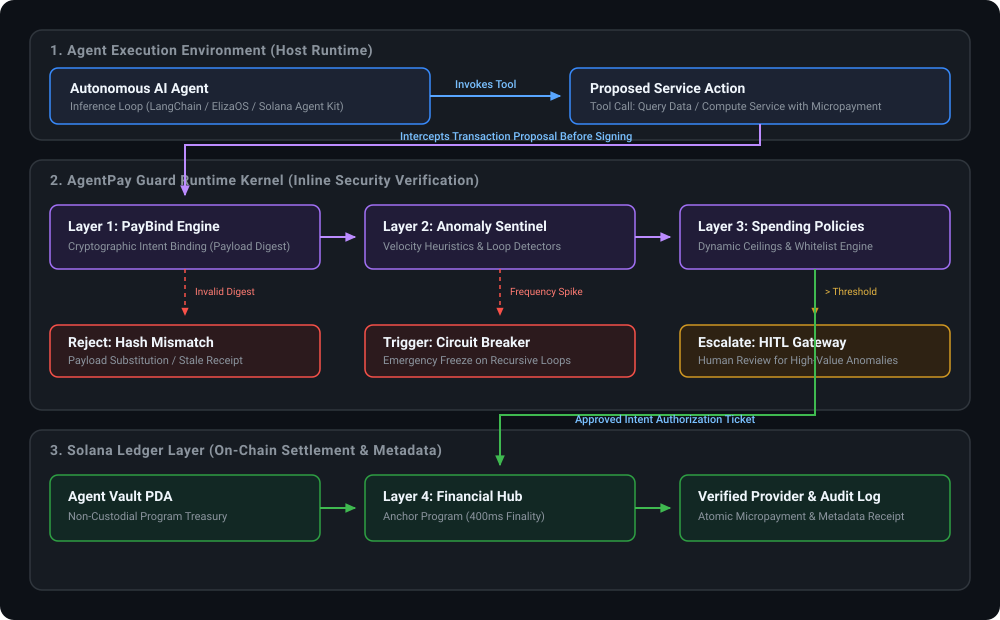
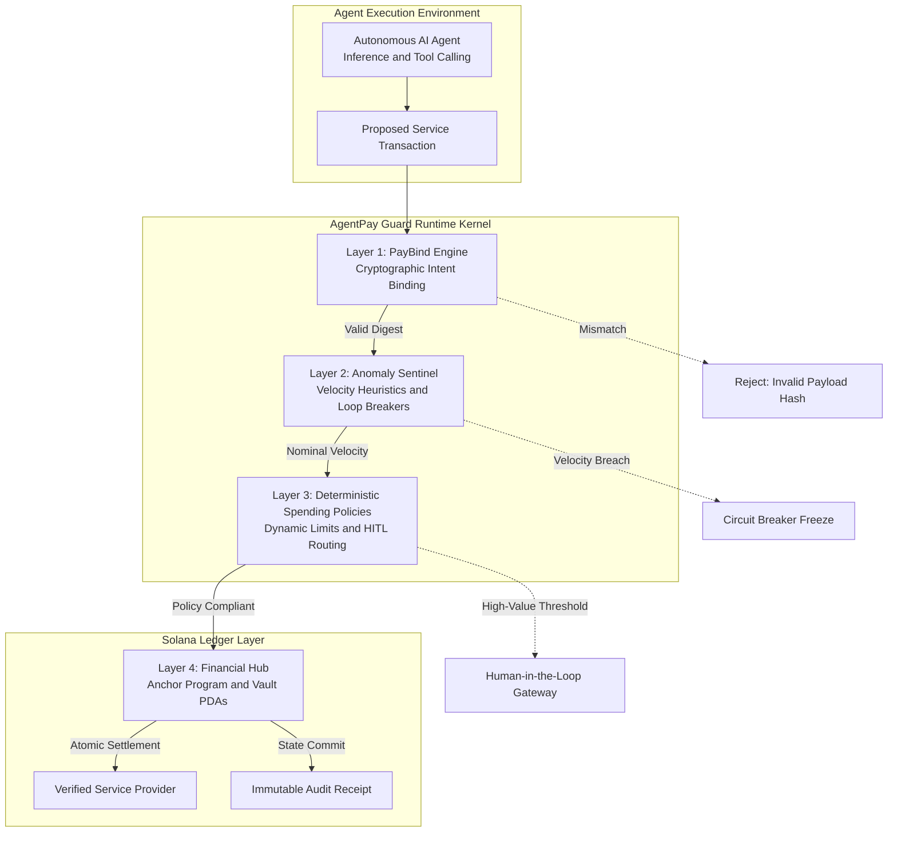

# AgentPay Guard

### Run-Time Financial Governance and Security Layer for Autonomous Agents on Solana

[](https://arena.colosseum.org)
[](https://solana.com)
[](#)
[](#)

---

## 1. Overview

Autonomous AI agents are getting their own wallets, but signing raw transactions with private keys is a recipe for disaster.

We’re designing **AgentPay Guard** for the **Colosseum Hackathon**—a run-time financial governance and security layer built specifically for autonomous agents settling on Solana.

Operating as an inline security kernel between agent inference runtimes and on-chain signing mechanisms, AgentPay Guard ensures that autonomous economic actions remain bounded, cryptographically verifiable, and protected against cognitive compromise.

---

## 2. Problem Statement

Current agent wallet integrations rely on standard programmatic keypairs or unconstrained programmatic accounts. This architecture exposes autonomous systems to three critical attack vectors:

1. **Catastrophic Prompt Injections & Treasury Depletion**  
   Giving an autonomous agent an unrestricted wallet means a single prompt injection can drain its treasury in infinite loops. Malicious input, unhandled exceptions, or hallucinated execution plans can trigger rapid programmatic transfers that exhaust liquidity in seconds.

2. **Rigid Spending Controls vs. Agent Autonomy**  
   Static token limits break continuous agent-to-agent workflows. Hard spending ceilings either abort long-running autonomous workflows unexpectedly or force developers to grant overly permissive allowances that invalidate security guarantees.

3. **Receipt Replay and Resource Substitution**  
   Without cryptographically binding a payment to an exact service response, agents are vulnerable to receipt replay and resource substitution. Malicious service providers can accept payment and deliver stale, corrupted, or synthetic responses without atomic validation.

---

> **[Update screenshot: Problem Landscape & Prompt Injection Exploitation Vector]**  
> *Figure 1: Demonstration of unconstrained agent wallet vulnerability under adversarial prompt injection vs. protected transaction pipeline.*

---

## 3. Protocol Architecture

AgentPay Guard implements a **four-layer verification protocol** designed to execute in parallel with agent reasoning cycles, validating state transitions prior to transaction assembly and signature.



<details>
<summary><b>View Mermaid Specification</b></summary>



</details>

### Layer 1: PayBind Engine
- **Cryptographic Intent Binding:** Ties outgoing micropayments directly to verifiable resource payload hashes (BLAKE3/SHA-256 digests).
- **Atomic Verification:** Guarantees that settlement instructions release funds only upon receipt of cryptographic delivery proofs corresponding to the verified payload hash.
- **Protection Scope:** Mitigates receipt replay, front-running, and payload substitution across agent-to-agent and agent-to-API communication channels.

### Layer 2: Anomaly Sentinel
- **Real-Time Velocity Heuristics:** Tracks transactional call velocity, frequency distributions, and spend acceleration curves across sliding time windows.
- **Automated Circuit Breakers:** Automatically freezes rogue agent loops upon detecting infinite recursive tool calls, anomalous query frequencies, or anomalous fee spikes.
- **Protection Scope:** Traps runaway agent execution threads within sub-second intervals before treasury balances sustain material damage.

### Layer 3: Deterministic Spending Policies
- **Dynamic Policy Enforcement:** Applies contextual, per-transaction caps, temporal budgets (hourly/daily sliding caps), and cryptographic recipient allowlists.
- **Human-in-the-Loop (HITL) Escalation:** Routes out-of-bounds, high-value, or anomalous transactions to off-chain human reviewers via encrypted notification webhooks.
- **Protection Scope:** Prevents unauthorized recipient diversion and confines agent financial discretion within mathematically deterministic parameters.

### Layer 4: Financial Hub
- **On-Chain Auditability:** Links raw Solana transfers directly to on-chain service metadata, session digests, and fulfillment proofs using Anchor Program Derived Addresses (PDAs).
- **Auditable Settlement:** Produces an immutable, indexable ledger of autonomous spending, facilitating enterprise compliance and multi-agent accounting.

---

> **[Update screenshot: Four-Layer Security Kernel State Machine]**  
> *Figure 2: Protocol state machine illustrating verification stages, PDA settlement flow, and circuit breaker trip points.*

---

> **[Update screenshot: Security Dashboard & Real-Time Sentinel Telemetry]**  
> *Figure 3: Live telemetry interface demonstrating velocity monitoring, active policies, and intercepted adversarial transactions.*

---

## 4. Why Solana?

Autonomous agent pipelines require sub-second reasoning and micro-cent execution fees. Solana’s 400ms finality and low costs make streaming agent queries economically viable without bottlenecking inference pipelines.

| Requirement | Solana Performance Attribute | Architectural Benefit |
|---|---|---|
| **Low-Latency Finality** | 400ms block times | Agent reasoning cycles execute tool calls without blocking on block settlement confirmations. |
| **Micro-Cent Fees** | <$0.001 per transaction | Enables granular, per-query micropayments without disproportionate fee overhead. |
| **State Composability** | Program Derived Addresses (PDAs) | Non-custodial vault control, deterministic escrow states, and programmatic authority delegation. |
| **High Throughput** | Parallelized runtime (Sealevel) | Real-time audit metadata ingestion without incurring network congestion penalties. |

---

## 5. Team Engineering Division (3-Person Split)

Responsibilities are distributed across three engineers with distinct technical deliverables and explicit interface boundaries:

```
+-----------------------------------+-----------------------------------+-----------------------------------+
|      Engineer 1: On-Chain Lead    |     Engineer 2: Protocol Lead     |   Engineer 3: Sentinel & UI Lead  |
|  Solana Program & Financial Hub   | PayBind Engine & Middleware SDK   | Anomaly Sentinel, HITL & Dashboard|
+-----------------------------------+-----------------------------------+-----------------------------------+
```

### Engineer 1: Solana On-Chain & Financial Hub Lead
*Core Domain: Anchor Program, Program Derived Addresses (PDAs), Settlement Contracts, and Security Invariants.*

- **Anchor Core Contract (`agentpay_guard`):** Develop the base on-chain program on Solana Devnet managing agent accounts, authority delegations, and vault states.
- **Vault PDA & Authority Management:** Implement secure programmatic accounts for treasury storage, time-locked withdrawals, and multisig overrides.
- **Financial Hub Metadata Engine:** Implement instruction schemas that append session identifiers, service hashes, and payload digests to token/SOL transfer instructions.
- **On-Chain Circuit Breakers:** Develop permissioned state flags allowing authorized Sentinel signers to execute emergency freeze instructions instantly.
- **Formal Verification & Unit Testing:** Author Bankrun and LiteSVM test fixtures validating access control, rent exemption, and account validation constraints.

### Engineer 2: PayBind Engine & Cryptographic Middleware Lead
*Core Domain: Runtime Interception, Intent Serialization, Cryptographic Verification, and Agent Framework SDKs.*

- **PayBind Engine Core:** Construct cryptographic hashing utilities binding transaction requests to standardized service payloads and response schemas.
- **Spending Policy Evaluator:** Implement deterministic evaluation logic for per-transaction ceilings, rate limits, and dynamic recipient allowlists.
- **Agent Framework Middleware:** Build drop-in interceptor adapters compatible with LangChain, ElizaOS, and the Solana Agent Kit.
- **Intent Serialization Protocols:** Define standard Borsh and JSON-LD data schemas for intent manifests, ensuring cross-platform serialization determinism.
- **Integration Test Harness:** Develop test suites verifying that tool calls in autonomous agents are correctly trapped, analyzed, and dispatched.

### Engineer 3: Anomaly Sentinel, Circuit Breakers & Observability Lead
*Core Domain: Velocity Heuristics, Pattern Recognition, HITL Escalation, and Audit UI.*

- **Velocity Heuristics Engine:** Develop sliding-window telemetry calculators tracking transaction velocity, spend acceleration, and repeated action cycles.
- **Circuit Breaker Service:** Build the low-latency off-chain daemon that triggers emergency freeze instructions when heuristics breach thresholds.
- **Human-in-the-Loop Gateway:** Construct an asynchronous escalation service (Webhook/Telegram/Web) allowing humans to approve or deny high-risk actions.
- **Observability Dashboard:** Implement a responsive monitoring console displaying live transaction telemetry, blocked attacks, and active policies.
- **Adversarial Test Suite:** Create realistic attack vectors (prompt injection jailbreaks, infinite spend loops, and payload substitution) for validation and demo recording.

---

## 6. Implementation Milestones

```
Milestone 1: Interface & Schema Definition (Days 1–3)
├── System architecture specification & threat model sign-off
├── Borsh & JSON schema definition for PayBind intent manifests
└── Anchor account structures & error code definitions

Milestone 2: Core Components Development (Days 4–9)
├── Engineer 1: Anchor program implementation (Vault PDA, Financial Hub, Freeze instruction)
├── Engineer 2: PayBind cryptographic hashing core & local policy evaluation engine
└── Engineer 3: Velocity heuristics service & sliding-window rate limiters

Milestone 3: End-to-End Integration (Days 10–14)
├── Agent runtime middleware integration with Solana Agent Kit & ElizaOS
├── Off-chain Sentinel connection to on-chain freeze authority
└── Human-in-the-Loop approval notification flow implementation

Milestone 4: Adversarial Testing & Hardening (Days 15–18)
├── Execution of prompt injection wallet-drain simulation
├── Stress test of 400ms finality micro-settlement pipeline
└── Security audit of Anchor account constraints and signing permissions

Milestone 5: Demonstration, Documentation & Colosseum Submission (Days 19–21)
├── Deployment to Solana Devnet with verified program artifacts
├── Live monitoring dashboard deployment
└── Recording of technical demo video illustrating threat mitigation
```

---

## 7. Technical Data Flow

1. **Invocation:** An autonomous agent decides to purchase data or compute from an external provider.
2. **Interception:** The AgentPay Guard SDK middleware intercepts the transaction proposal before keypair signing.
3. **Payload Binding:** The PayBind Engine computes the cryptographic hash of the requested resource specification.
4. **Sentinel Verification:** The Anomaly Sentinel cross-references the current transaction frequency against velocity baselines.
5. **Deterministic Policy Check:** The transaction is evaluated against per-tx caps, cumulative daily limits, and destination allowlists.
   - *Breach Detected:* Sentinel triggers the on-chain circuit breaker or queues a Human-in-the-Loop escalation ticket.
   - *Validation Passed:* An ephemeral cryptographic authorization ticket is issued.
6. **Execution & Settlement:** The Financial Hub on Solana verifies the authorization ticket, settles payment from the Agent Vault PDA, and logs service metadata.
7. **Fulfillment:** The service provider verifies the on-chain settlement transaction and returns the signed resource matching the original PayBind hash.

---

## 8. Repository Layout

```text
AgentPay-Guard/
├── README.md                          # Implementation specification & project roadmap
├── programs/                          # Solana smart contracts (Anchor)
│   └── agentpay-guard/
│       ├── src/
│       │   ├── lib.rs                 # Program entrypoint & instruction routing
│       │   ├── state/                 # PDA account definitions (Vault, Policy, Receipt)
│       │   ├── instructions/          # Handlers: initialize, bind_payment, settle, freeze
│       │   └── errors.rs              # Program-specific error declarations
│       └── Cargo.toml
├── packages/
│   ├── paybind-core/                  # Cryptographic intent binding, RFC 8785 canonicalization & policy engine
│   ├── anomaly-sentinel/              # Velocity heuristics, sliding-window rate limiters & circuit breakers
│   ├── agent-sdk/                     # Runtime interceptor & adapters (ElizaOS, LangChain, Solana Agent Kit)
│   └── dashboard/                     # Telemetry visualizer & HITL escalation portal UI
├── .agents/skills/                    # Team engineering skills & agent playbooks
│   ├── solana-anchor-development/     # Anchor & PDA development procedures
│   ├── agent-wallet-security/         # Non-custodial vault & key management standards
│   ├── paybind-intent-protocol/       # Payload canonicalization & hash binding specs
│   ├── agent-middleware-interceptor/  # Runtime interceptor & tool wrapping patterns
│   ├── velocity-heuristics-sentinel/  # Sliding-window rate limiters & loop detectors
│   ├── hitl-escalation-workflow/      # Asynchronous human-in-the-loop escalation
│   └── adversarial-attack-simulation/ # Jailbreak & wallet-drain test harness
└── tests/
    ├── anchor/                        # Anchor program unit and integration tests
    └── adversarial/                   # Prompt injection & infinite loop test harness
```

---

## 9. Team Engineering Skills & Playbooks

The repository includes curated engineering playbooks located in `.agents/skills/` to standardize development across the team:

- [Solana Anchor Program Development](.agents/skills/solana-anchor-development/SKILL.md) — Anchor program architecture, PDA constraints, CPI safety, and LiteSVM/Bankrun testing.
- [Agent Wallet Security Standards](.agents/skills/agent-wallet-security/SKILL.md) — Non-custodial vault architectures, key isolation, and preventing prompt-injection key leaks.
- [PayBind Intent Protocol Specification](.agents/skills/paybind-intent-protocol/SKILL.md) — RFC 8785 canonical serialization, BLAKE3/SHA-256 payload digest generation, and atomic delivery verification.
- [Agent Middleware & Interceptor Architecture](.agents/skills/agent-middleware-interceptor/SKILL.md) — Tool-calling interception patterns for LangChain, ElizaOS, and Solana Agent Kit.
- [Anomaly Sentinel & Velocity Heuristics](.agents/skills/velocity-heuristics-sentinel/SKILL.md) — Sliding-window algorithms, leaky-bucket rate limiting, recursive loop detection, and freeze triggers.
- [Human-in-the-Loop Escalation Workflows](.agents/skills/hitl-escalation-workflow/SKILL.md) — Out-of-bounds threshold routing, cryptographic approval tickets, and timeout handling.
- [Adversarial Attack Simulation & Evaluation Suite](.agents/skills/adversarial-attack-simulation/SKILL.md) — Test suites for prompt-injection wallet drains, infinite reasoning loops, and payload substitution defense demonstrations.